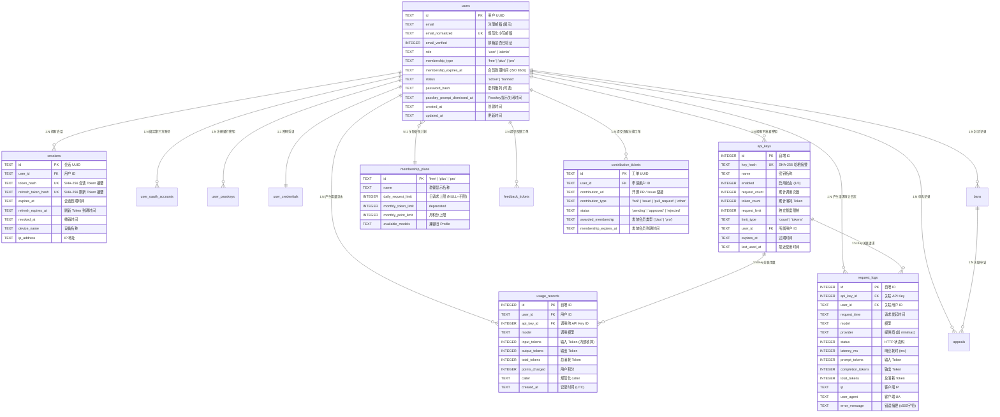

# StudyPulse Cloud AI — 数据库 Schema 架构文档

**版本:** `1.0-release`  
**数据库引擎:** Cloudflare D1 (Edge SQLite) / 兼容 Supabase (PostgreSQL)  
**架构模式:** 账本模式 (Ledger Pattern) + 零 Cron 动态时间窗口 + 隐私优先无状态网关  
**最后更新:** 2026-08-28  

---

## 1. 概述与设计理念

StudyPulse Cloud AI 是基于 Cloudflare Workers 与 D1 边缘数据库构建的高可用、多租户 AI 转发网关与计费中枢。数据库设计遵循以下核心原则：

1. **统一用户实体与双轨鉴权**：系统支持 Web/iOS 端的会话凭证（`sessions`）与开发者密钥（`api_keys`），两者在底层统一解析并汇聚至用户实体（`users`）。
2. **只追加账本模式 (Append-only Ledger)**：用量与 Token 消耗通过 `usage_records` 独立记录流水，不采用易产生写冲突与数据丢失的扣减字段更新方案。
3. **零 Cron 动态时间窗口**：按 UTC+8 (北京时间) 的自然日与自然月起点动态计算聚合范围，实现毫秒级额度重置与会员到期降级隔离。
4. **隐私优先的无状态设计**：AI 请求日志 `request_logs` 仅记录调用元数据、耗时与 Token 统计，**绝不持久化存储 prompt 与 reply 原始文本**。对话上下文由客户端在请求体中维护；同时提供云端会话同步扩展 Schema。

---

## 2. 实体关系图 (ER Diagram)



---

## 3. 核心领域模型与重点表设计映射

| 业务实体概念 | 对应数据库表 / 字段 | 核心职责说明 |
| :--- | :--- | :--- |
| **`users`** | `users`, `user_credentials`, `user_oauth_accounts`, `user_passkeys` | 用户账户核心、多端认证凭据、封禁状态与会员权益属性 |
| **`plans`** | `membership_plans` | 会员套餐规格定义（日请求数、月 Token 数、支持模型白名单） |
| **`subscriptions`** | `users` (`membership_type`, `membership_expires_at`) + `contribution_tickets` | 用户订阅生命周期、有效期限、到期降级与开源贡献兑换会员记录 |
| **`usage`** | `usage_records` + `api_keys` (`request_count`, `token_count`) | 请求次数与用量流水账本，支撑动态时间窗口实时聚合 |
| **`token_usage`** | `usage_records` (`input_tokens`, `output_tokens`, `total_tokens`) | 精细化 Token 账本（Prompt / Completion 拆分与汇总） |
| **`ai_requests`** | `request_logs` | 请求全链路日志（HTTP 状态码、网关延时、模型提供商、报错信息） |
| **`conversations`** | 客户端本地状态管理 / 云端同步扩展模型 | 遵循隐私最小化原则，网关侧不落盘会话内容，提供标准多端同步扩展规范 |

---

## 4. 重点表详细设计与字段字典

### 4.1 `users`（用户核心表）

存储用户的统一身份标识、安全状态与当前生效的会员信息。

```sql
CREATE TABLE IF NOT EXISTS users (
    id                            TEXT PRIMARY KEY,              -- UUID (v4)
    email                         TEXT UNIQUE NOT NULL,          -- 原始注册邮箱（用于展示）
    email_normalized              TEXT UNIQUE,                   -- 规范化小写邮箱（用于索引检索与唯一校验）
    email_verified                INTEGER NOT NULL DEFAULT 0,    -- 邮箱验证状态 (0=未验证, 1=已验证)
    role                          TEXT NOT NULL DEFAULT 'user',  -- 用户角色 ('user' | 'admin')
    membership_type               TEXT NOT NULL DEFAULT 'free',  -- 基础/当前套餐 ('free' | 'plus' | 'pro')
    membership_expires_at         TEXT,                          -- 会员到期时间 (ISO 8601 UTC)，NULL 表示永久/按默认处理
    github_id                     TEXT UNIQUE,                   -- GitHub 账号 ID (预留/兼容字段)
    username                      TEXT,                          -- 用户名 (来自 OAuth 或自定义)
    avatar_url                    TEXT,                          -- 头像 URL
    status                        TEXT NOT NULL DEFAULT 'active',-- 账号状态 ('active' | 'banned')
    password_hash                 TEXT,                          -- 密码散列兼容字段
    passkey_prompt_dismissed_at   TEXT,                          -- 用户主动跳过 Passkey 引导的时间戳
    created_at                    TEXT NOT NULL DEFAULT CURRENT_TIMESTAMP,
    updated_at                    TEXT NOT NULL DEFAULT CURRENT_TIMESTAMP
);

CREATE INDEX IF NOT EXISTS idx_users_email ON users(email);
CREATE INDEX IF NOT EXISTS idx_users_role ON users(role);
CREATE UNIQUE INDEX IF NOT EXISTS idx_users_email_normalized ON users(email_normalized);
```

### 4.2 `membership_plans`（会员计划 / Plans 表）

定义系统内所有套餐的配额规则。数据库配置化，管理员可热更新而无需重启或修改代码。

```sql
CREATE TABLE IF NOT EXISTS membership_plans (
    id                  TEXT PRIMARY KEY,                      -- 套餐标识符 ('free' | 'plus' | 'pro')
    name                TEXT NOT NULL,                         -- 套餐显示名称 ('Free' | 'Plus' | 'Pro')
    daily_request_limit INTEGER,                              -- 每日请求上限 (NULL 表示不限制)
    monthly_token_limit INTEGER,                              -- deprecated；用户配额改用 monthly_point_limit
    monthly_point_limit INTEGER,                              -- 每月 AI Points 上限 (NULL 表示不限制)
    available_models    TEXT NOT NULL DEFAULT '["MiniMax-M3"]' -- 兼容旧 Profile；官方 /v1/chat 忽略
);
```

#### 当前预置套餐数据（INTERNAL_TEST 积分）：
- **`free`**: 5 次/日，5,000 Points/月
- **`plus`**: 50 次/日，200,000 Points/月
- **`pro`**: 200 次/日，400,000 Points/月

`monthly_point_limit` 由 migration `0023_ai_router_points.sql` 添加。历史 Token 不折算为积分。

### 4.3 `subscriptions`（订阅体系与贡献兑换工单）

当前系统订阅状态内嵌于 `users` 表中的 `membership_type` 与 `membership_expires_at`，由开源贡献兑换流 `contribution_tickets` 进行会员发放：

```sql
CREATE TABLE IF NOT EXISTS contribution_tickets (
    id                    TEXT PRIMARY KEY,                       -- 工单 UUID
    user_id               TEXT NOT NULL,                          -- 申请用户 ID (FK users.id)
    email                 TEXT NOT NULL,                          -- 申请人联系邮箱
    contribution_url      TEXT NOT NULL,                          -- 开源贡献链接 (GitHub PR / Issue / Fork)
    contribution_type     TEXT NOT NULL DEFAULT 'other' 
                          CHECK (contribution_type IN ('fork', 'issue', 'pull_request', 'other')),
    description           TEXT,                                   -- 贡献补充说明
    status                TEXT NOT NULL DEFAULT 'pending' 
                          CHECK (status IN ('pending', 'approved', 'rejected')),
    awarded_membership    TEXT CHECK (awarded_membership IN ('plus', 'pro')), -- 审批发放的会员类型
    membership_expires_at TEXT,                                   -- 审批发放的会员截止时间
    admin_reply           TEXT,                                   -- 管理员审核回复
    created_at            TEXT NOT NULL DEFAULT CURRENT_TIMESTAMP,
    reviewed_at           TEXT,                                   -- 审核处理时间
    FOREIGN KEY (user_id) REFERENCES users(id) ON DELETE CASCADE
);

CREATE INDEX IF NOT EXISTS idx_contribution_status_created ON contribution_tickets(status, created_at);
CREATE INDEX IF NOT EXISTS idx_contribution_user_created ON contribution_tickets(user_id, created_at DESC);
```

### 4.4 `usage_records`（用量账本与 Token 统计表）

系统核心计费与限流数据源。每一次成功的 AI 对话（非流式或 SSE 流式结束）均单调追加一条记录。

```sql
CREATE TABLE IF NOT EXISTS usage_records (
    id              INTEGER PRIMARY KEY AUTOINCREMENT,        -- 自增主键
    user_id         TEXT,                                     -- 消费用户 ID (FK users.id)
    api_key_id      INTEGER,                                  -- 通过 API Key 调用时的 Key ID (FK api_keys.id, 可空)
    model           TEXT,                                     -- 调用的模型名称 (如 'MiniMax-M3')
    input_tokens    INTEGER DEFAULT 0,
    output_tokens   INTEGER DEFAULT 0,
    total_tokens    INTEGER DEFAULT 0,
    reasoning_tokens INTEGER NOT NULL DEFAULT 0,
    points_charged  INTEGER NOT NULL DEFAULT 0,
    provider        TEXT,
    caller          TEXT,
    requested_thinking TEXT,
    effective_thinking TEXT,
    pricing_version TEXT,
    routing_version TEXT,
    created_at      TEXT NOT NULL DEFAULT CURRENT_TIMESTAMP
);

CREATE INDEX IF NOT EXISTS idx_usage_records_user_id ON usage_records(user_id);
CREATE INDEX IF NOT EXISTS idx_usage_records_created_at ON usage_records(created_at);
CREATE INDEX IF NOT EXISTS idx_usage_records_user_created ON usage_records(user_id, created_at);
```

### 4.5 `request_logs`（AI 请求审计日志表）

记录所有网关接收的请求（包含成功 200 与各类错误 400/401/403/429/500/502），用于运维监控、延迟分析与安全审计。

```sql
CREATE TABLE IF NOT EXISTS request_logs (
    id                INTEGER PRIMARY KEY AUTOINCREMENT,      -- 自增主键
    api_key_id        INTEGER,                                -- 关联的 API Key (可为空)
    user_id           TEXT,                                   -- 关联的用户 ID (可为空)
    request_time      TEXT NOT NULL DEFAULT CURRENT_TIMESTAMP,-- 请求时间 (UTC)
    model             TEXT,                                   -- 目标模型
    provider          TEXT,                                   -- 上游提供商 ('minimax')
    status            INTEGER NOT NULL,                       -- 响应状态码 (200, 429, 502 等)
    latency_ms        INTEGER,                                -- 全链路耗时 (毫秒)
    prompt_tokens     INTEGER,
    completion_tokens INTEGER,
    total_tokens      INTEGER,
    reasoning_tokens  INTEGER,
    points_charged    INTEGER,
    caller            TEXT,
    requested_thinking TEXT,
    effective_thinking TEXT,
    routing_version   TEXT,
    fallback_used     INTEGER NOT NULL DEFAULT 0,
    fallback_reason   TEXT,
    primary_model     TEXT,
    ip                TEXT,
    user_agent        TEXT,
    error_message     TEXT
);

CREATE INDEX IF NOT EXISTS idx_request_logs_api_key_id ON request_logs(api_key_id);
CREATE INDEX IF NOT EXISTS idx_request_logs_request_time ON request_logs(request_time);
CREATE INDEX IF NOT EXISTS idx_request_logs_status ON request_logs(status);
CREATE INDEX IF NOT EXISTS idx_request_logs_user_id ON request_logs(user_id);
```

### 4.6 `conversations`（会话与消息模型 — 架构规范与扩展 Schema）

#### 当前架构设计说明：
- **无状态网关 (Stateless Gateway)**：StudyPulse Cloud AI 遵循**端到端隐私保护**原则，网关不对用户的会话历史与聊天内容进行落盘存储。
- **客户端上下文维护**：iOS App 客户端在发起 `POST /v1/chat` 请求时，在请求体 `messages: [...]` 中自带多轮对话上下文与多模态数据。

#### 云端会话同步扩展设计（用于多端漫游与云端备份）：
若需要开启云端多端同步，可直接应用以下标准会话与消息表：

```sql
-- 会话主题表
CREATE TABLE IF NOT EXISTS conversations (
    id          TEXT PRIMARY KEY,                             -- 会话 UUID
    user_id     TEXT NOT NULL,                                -- 所属用户 ID (FK users.id)
    title       TEXT NOT NULL DEFAULT '新对话',                -- 对话标题
    model       TEXT NOT NULL DEFAULT 'MiniMax-M3',           -- 选定模型
    pinned      INTEGER NOT NULL DEFAULT 0,                   -- 是否置顶 (0/1)
    archived    INTEGER NOT NULL DEFAULT 0,                   -- 是否归档 (0/1)
    created_at  TEXT NOT NULL DEFAULT CURRENT_TIMESTAMP,
    updated_at  TEXT NOT NULL DEFAULT CURRENT_TIMESTAMP,
    FOREIGN KEY (user_id) REFERENCES users(id) ON DELETE CASCADE
);

CREATE INDEX IF NOT EXISTS idx_conversations_user_updated ON conversations(user_id, updated_at DESC);

-- 对话消息明细表
CREATE TABLE IF NOT EXISTS conversation_messages (
    id              TEXT PRIMARY KEY,                         -- 消息 UUID
    conversation_id TEXT NOT NULL,                            -- 所属会话 ID (FK conversations.id)
    role            TEXT NOT NULL CHECK (role IN ('system', 'user', 'assistant', 'tool')),
    content         TEXT NOT NULL,                            -- 消息文本内容 (或 JSON 序列化多模态数据)
    tokens          INTEGER DEFAULT 0,                        -- 单条消息估算/实际 Token 数
    created_at      TEXT NOT NULL DEFAULT CURRENT_TIMESTAMP,
    FOREIGN KEY (conversation_id) REFERENCES conversations(id) ON DELETE CASCADE
);

CREATE INDEX IF NOT EXISTS idx_messages_conversation_created ON conversation_messages(conversation_id, created_at ASC);
```

---

## 5. 辅助与安全支撑表结构

### 5.1 认证与凭据类

- **`sessions`**：管理用户 Web / App 端登录态。保存 SHA-256 摘要（`token_hash` 与 `refresh_token_hash`）、设备名称、IP、撤销时间戳 `revoked_at`。
- **`user_credentials`**：用户密码凭据表，采用 Web Crypto PBKDF2-HMAC-SHA-256 算法，包含加盐参数与错误重试短期锁定字段（`locked_until`）。
- **`user_oauth_accounts`**：支持 GitHub / 第三方 OAuth 绑定，保证 `(provider, provider_user_id)` 与 `(provider, provider_email)` 唯一约束。
- **`user_passkeys`**：WebAuthn FIDO2 通行密钥凭证表，存储 `credential_id`、`public_key`、`sign_count` 及备份标记。
- **`auth_challenges`**：一次性密码设置、邮箱绑定与二次验证挑战表（短期失效，`used=1` 防重放）。
- **`auth_rate_limits`**：基于 D1 的登录防爆破限流表，按 `key_hash = SHA256(scope + identifier)` 隔离计数，不存明文 IP/邮箱。
- **`email_verification_codes`**：6 位邮箱验证码，区分 `login` / `register` / `reset_password` 业务意图，具备 5 次重试保护。

### 5.2 开发者生态与管控类

- **`api_keys`**：开发者独立 API Key。仅存储 `SHA-256(key)`，支持绑定用户 `user_id`，独立限额或由套餐统一管辖。
- **`admin_logs`**：管理员操作审计流水（调整会员、修改角色、封禁解封等）。
- **`bans` & `appeals`**：账号封禁记录与用户自助申诉工单系统。
- **`feedback_tickets`**：用户体验与问题反馈工单表（支持优先级 `normal`/`urgent`/`top`）。
- **`blacklisted_emails`**：邮箱黑名单表，防止恶意注册。

---

## 6. Drizzle ORM Schema 定义 (`drizzle/schema.ts`)

```typescript
import { sqliteTable, text, integer, uniqueIndex, index } from "drizzle-orm/sqlite-core";
import { sql } from "drizzle-orm";

// 1. 用户核心表
export const users = sqliteTable("users", {
    id: text("id").primaryKey(),
    email: text("email").notNull().unique(),
    emailNormalized: text("email_normalized").unique(),
    emailVerified: integer("email_verified").notNull().default(0),
    role: text("role", { enum: ["user", "admin"] }).notNull().default("user"),
    membershipType: text("membership_type", { enum: ["free", "plus", "pro"] }).notNull().default("free"),
    membershipExpiresAt: text("membership_expires_at"),
    githubId: text("github_id").unique(),
    username: text("username"),
    avatarUrl: text("avatar_url"),
    status: text("status", { enum: ["active", "banned"] }).notNull().default("active"),
    passwordHash: text("password_hash"),
    passkeyPromptDismissedAt: text("passkey_prompt_dismissed_at"),
    createdAt: text("created_at").notNull().default(sql`CURRENT_TIMESTAMP`),
    updatedAt: text("updated_at").notNull().default(sql`CURRENT_TIMESTAMP`),
}, (table) => ({
    emailIdx: index("idx_users_email").on(table.email),
    roleIdx: index("idx_users_role").on(table.role),
    emailNormalizedIdx: uniqueIndex("idx_users_email_normalized").on(table.emailNormalized),
}));

// 2. 会员计划表
export const membershipPlans = sqliteTable("membership_plans", {
    id: text("id").primaryKey(), // 'free' | 'plus' | 'pro'
    name: text("name").notNull(),
    dailyRequestLimit: integer("daily_request_limit"),
    monthlyTokenLimit: integer("monthly_token_limit"),
    availableModels: text("available_models").notNull().default('["MiniMax-M3"]'),
});

// 3. 用量记录表 (Ledger)
export const usageRecords = sqliteTable("usage_records", {
    id: integer("id").primaryKey({ autoIncrement: true }),
    userId: text("user_id").references(() => users.id, { onDelete: "set null" }),
    apiKeyId: integer("api_key_id").references(() => apiKeys.id, { onDelete: "set null" }),
    model: text("model"),
    inputTokens: integer("input_tokens").default(0),
    outputTokens: integer("output_tokens").default(0),
    totalTokens: integer("total_tokens").default(0),
    createdAt: text("created_at").notNull().default(sql`CURRENT_TIMESTAMP`),
}, (table) => ({
    userIdIdx: index("idx_usage_records_user_id").on(table.userId),
    createdAtIdx: index("idx_usage_records_created_at").on(table.createdAt),
    userCreatedIdx: index("idx_usage_records_user_created").on(table.userId, table.createdAt),
}));

// 4. 请求日志表
export const requestLogs = sqliteTable("request_logs", {
    id: integer("id").primaryKey({ autoIncrement: true }),
    apiKeyId: integer("api_key_id"),
    userId: text("user_id"),
    requestTime: text("request_time").notNull().default(sql`CURRENT_TIMESTAMP`),
    model: text("model"),
    provider: text("provider"),
    status: integer("status").notNull(),
    latencyMs: integer("latency_ms"),
    promptTokens: integer("prompt_tokens"),
    completionTokens: integer("completion_tokens"),
    totalTokens: integer("total_tokens"),
    ip: text("ip"),
    userAgent: text("user_agent"),
    errorMessage: text("error_message"),
}, (table) => ({
    apiKeyIdx: index("idx_request_logs_api_key_id").on(table.apiKeyId),
    requestTimeIdx: index("idx_request_logs_request_time").on(table.requestTime),
    statusIdx: index("idx_request_logs_status").on(table.status),
    userIdIdx: index("idx_request_logs_user_id").on(table.userId),
}));

// 5. API Keys 表
export const apiKeys = sqliteTable("api_keys", {
    id: integer("id").primaryKey({ autoIncrement: true }),
    keyHash: text("key_hash").notNull().unique(),
    name: text("name").notNull(),
    enabled: integer("enabled").notNull().default(1),
    requestCount: integer("request_count").notNull().default(0),
    requestLimit: integer("request_limit"),
    limitType: text("limit_type").notNull().default("count"),
    tokenCount: integer("token_count").notNull().default(0),
    userId: text("user_id").references(() => users.id, { onDelete: "cascade" }),
    notes: text("notes"),
    expiresAt: text("expires_at"),
    createdAt: text("created_at").notNull().default(sql`CURRENT_TIMESTAMP`),
    lastUsedAt: text("last_used_at"),
}, (table) => ({
    keyHashIdx: index("idx_api_keys_key_hash").on(table.keyHash),
    enabledIdx: index("idx_api_keys_enabled").on(table.enabled),
}));

// 6. 会话表
export const sessions = sqliteTable("sessions", {
    id: text("id").primaryKey(),
    userId: text("user_id").notNull().references(() => users.id, { onDelete: "cascade" }),
    tokenHash: text("token_hash").notNull().unique(),
    refreshTokenHash: text("refresh_token_hash").unique(),
    expiresAt: text("expires_at").notNull(),
    refreshExpiresAt: text("refresh_expires_at"),
    lastUsedAt: text("last_used_at"),
    createdAt: text("created_at").notNull(),
    revokedAt: text("revoked_at"),
    deviceName: text("device_name"),
    userAgent: text("user_agent"),
    ipAddress: text("ip_address"),
}, (table) => ({
    userIdIdx: index("idx_sessions_user_id").on(table.userId),
    tokenHashIdx: index("idx_sessions_token_hash").on(table.tokenHash),
    refreshTokenIdx: uniqueIndex("idx_sessions_refresh_token_hash").on(table.refreshTokenHash),
}));
```

---

## 7. Prisma Schema 定义 (`prisma/schema.prisma`)

```prisma
datasource db {
  provider = "sqlite"
  url      = env("DATABASE_URL")
}

generator client {
  provider = "prisma-client-js"
}

model User {
  id                        String                @id @default(uuid())
  email                     String                @unique
  emailNormalized           String?               @unique @map("email_normalized")
  emailVerified             Int                   @default(0) @map("email_verified")
  role                      String                @default("user")
  membershipType            String                @default("free") @map("membership_type")
  membershipExpiresAt       String?               @map("membership_expires_at")
  githubId                  String?               @unique @map("github_id")
  username                  String?
  avatarUrl                 String?               @map("avatar_url")
  status                    String                @default("active")
  passwordHash              String?               @map("password_hash")
  passkeyPromptDismissedAt  String?               @map("passkey_prompt_dismissed_at")
  createdAt                 String                @default(dbgenerated("CURRENT_TIMESTAMP")) @map("created_at")
  updatedAt                 String                @default(dbgenerated("CURRENT_TIMESTAMP")) @map("updated_at")

  // 关联
  credentials               UserCredential?
  sessions                  Session[]
  oauthAccounts             UserOAuthAccount[]
  passkeys                  UserPasskey[]
  apiKeys                   ApiKey[]
  usageRecords              UsageRecord[]
  feedbackTickets           FeedbackTicket[]
  contributionTickets       ContributionTicket[]
  bans                      Ban[]
  appeals                   Appeal[]

  @@map("users")
  @@index([email], name: "idx_users_email")
  @@index([role], name: "idx_users_role")
}

model MembershipPlan {
  id                 String   @id // 'free' | 'plus' | 'pro'
  name               String
  dailyRequestLimit  Int?     @map("daily_request_limit")
  monthlyTokenLimit  Int?     @map("monthly_token_limit")
  availableModels    String   @default("[\"MiniMax-M3\"]") @map("available_models")

  @@map("membership_plans")
}

model UsageRecord {
  id           Int      @id @default(autoincrement())
  userId       String?  @map("user_id")
  apiKeyId     Int?     @map("api_key_id")
  model        String?
  inputTokens  Int      @default(0) @map("input_tokens")
  outputTokens Int      @default(0) @map("output_tokens")
  totalTokens  Int      @default(0) @map("total_tokens")
  createdAt    String   @default(dbgenerated("CURRENT_TIMESTAMP")) @map("created_at")

  user         User?    @relation(fields: [userId], references: [id], onDelete: SetNull)
  apiKey       ApiKey?  @relation(fields: [apiKeyId], references: [id], onDelete: SetNull)

  @@map("usage_records")
  @@index([userId], name: "idx_usage_records_user_id")
  @@index([createdAt], name: "idx_usage_records_created_at")
  @@index([userId, createdAt], name: "idx_usage_records_user_created")
}

model RequestLog {
  id                Int      @id @default(autoincrement())
  apiKeyId          Int?     @map("api_key_id")
  userId            String?  @map("user_id")
  requestTime       String   @default(dbgenerated("CURRENT_TIMESTAMP")) @map("request_time")
  model             String?
  provider          String?
  status            Int
  latencyMs         Int?     @map("latency_ms")
  promptTokens      Int?     @map("prompt_tokens")
  completionTokens  Int?     @map("completion_tokens")
  totalTokens       Int?     @map("total_tokens")
  ip                String?
  userAgent         String?  @map("user_agent")
  errorMessage      String?  @map("error_message")

  @@map("request_logs")
  @@index([apiKeyId], name: "idx_request_logs_api_key_id")
  @@index([requestTime], name: "idx_request_logs_request_time")
  @@index([status], name: "idx_request_logs_status")
  @@index([userId], name: "idx_request_logs_user_id")
}

model ApiKey {
  id           Int           @id @default(autoincrement())
  keyHash      String        @unique @map("key_hash")
  name         String
  enabled      Int           @default(1)
  requestCount Int           @default(0) @map("request_count")
  requestLimit Int?          @map("request_limit")
  limitType    String        @default("count") @map("limit_type")
  tokenCount   Int           @default(0) @map("token_count")
  userId       String?       @map("user_id")
  notes        String?
  expiresAt    String?       @map("expires_at")
  createdAt    String        @default(dbgenerated("CURRENT_TIMESTAMP")) @map("created_at")
  lastUsedAt   String?       @map("last_used_at")

  user         User?         @relation(fields: [userId], references: [id], onDelete: Cascade)
  usageRecords UsageRecord[]

  @@map("api_keys")
  @@index([keyHash], name: "idx_api_keys_key_hash")
  @@index([enabled], name: "idx_api_keys_enabled")
}

model Session {
  id                String   @id @default(uuid())
  userId            String   @map("user_id")
  tokenHash         String   @unique @map("token_hash")
  refreshTokenHash  String?  @unique @map("refresh_token_hash")
  expiresAt         String   @map("expires_at")
  refreshExpiresAt  String?  @map("refresh_expires_at")
  lastUsedAt        String?  @map("last_used_at")
  createdAt         String   @map("created_at")
  revokedAt         String?  @map("revoked_at")
  deviceName        String?  @map("device_name")
  userAgent         String?  @map("user_agent")
  ipAddress         String?  @map("ip_address")

  user              User     @relation(fields: [userId], references: [id], onDelete: Cascade)

  @@map("sessions")
  @@index([userId], name: "idx_sessions_user_id")
  @@index([tokenHash], name: "idx_sessions_token_hash")
}

model UserCredential {
  userId             String   @id @map("user_id")
  passwordHash       String   @map("password_hash")
  passwordSalt       String   @map("password_salt")
  passwordAlgorithm  String   @default("pbkdf2-sha256") @map("password_algorithm")
  passwordIterations Int      @map("password_iterations")
  passwordUpdatedAt  String   @map("password_updated_at")
  failedLoginCount   Int      @default(0) @map("failed_login_count")
  lockedUntil        String?  @map("locked_until")
  createdAt          String   @map("created_at")
  updatedAt          String   @map("updated_at")

  user               User     @relation(fields: [userId], references: [id], onDelete: Cascade)

  @@map("user_credentials")
}

model UserOAuthAccount {
  id             String   @id @default(uuid())
  userId         String   @map("user_id")
  provider       String
  providerUserId String   @map("provider_user_id")
  providerEmail  String?  @map("provider_email")
  username       String?
  avatarUrl      String?  @map("avatar_url")
  createdAt      String   @default(dbgenerated("CURRENT_TIMESTAMP")) @map("created_at")
  updatedAt      String   @default(dbgenerated("CURRENT_TIMESTAMP")) @map("updated_at")

  user           User     @relation(fields: [userId], references: [id], onDelete: Cascade)

  @@unique([provider, providerUserId], name: "uq_provider_user")
  @@unique([provider, providerEmail], name: "idx_user_oauth_provider_email")
  @@index([userId], name: "idx_user_oauth_user_id")
  @@map("user_oauth_accounts")
}

model UserPasskey {
  credentialId String   @id @map("credential_id")
  userId       String   @map("user_id")
  publicKey    String   @map("public_key")
  signCount    Int      @default(0) @map("sign_count")
  transports   String?
  deviceType   String?  @map("device_type")
  backedUp     Int      @default(0) @map("backed_up")
  name         String   @default("Passkey")
  createdAt    String   @default(dbgenerated("CURRENT_TIMESTAMP")) @map("created_at")
  lastUsedAt   String?  @map("last_used_at")
  updatedAt    String   @default(dbgenerated("CURRENT_TIMESTAMP")) @map("updated_at")

  user         User     @relation(fields: [userId], references: [id], onDelete: Cascade)

  @@index([userId], name: "idx_user_passkeys_user_id")
  @@index([lastUsedAt], name: "idx_user_passkeys_last_used_at")
  @@map("user_passkeys")
}

model ContributionTicket {
  id                  String   @id @default(uuid())
  userId              String   @map("user_id")
  email               String
  contributionUrl     String   @map("contribution_url")
  contributionType    String   @default("other") @map("contribution_type")
  description         String?
  status              String   @default("pending")
  awardedMembership   String?  @map("awarded_membership")
  membershipExpiresAt String?  @map("membership_expires_at")
  adminReply          String?  @map("admin_reply")
  createdAt           String   @default(dbgenerated("CURRENT_TIMESTAMP")) @map("created_at")
  reviewedAt          String?  @map("reviewed_at")

  user                User     @relation(fields: [userId], references: [id], onDelete: Cascade)

  @@index([status, createdAt], name: "idx_contribution_status_created")
  @@index([userId, createdAt], name: "idx_contribution_user_created")
  @@map("contribution_tickets")
}

model FeedbackTicket {
  id          String   @id @default(uuid())
  userId      String   @map("user_id")
  subject     String
  content     String
  priority    String   @default("normal")
  status      String   @default("pending")
  adminReply  String?  @map("admin_reply")
  createdAt   String   @default(dbgenerated("CURRENT_TIMESTAMP")) @map("created_at")
  processedAt String?  @map("processed_at")

  user        User     @relation(fields: [userId], references: [id], onDelete: Cascade)

  @@index([status, priority, createdAt], name: "idx_feedback_pending_order")
  @@index([userId, createdAt], name: "idx_feedback_user_created")
  @@index([status, processedAt], name: "idx_feedback_processed_created")
  @@map("feedback_tickets")
}

model Ban {
  id          String   @id @default(uuid())
  userId      String   @map("user_id")
  reason      String
  appealToken String   @unique @map("appeal_token")
  status      String   @default("active")
  createdAt   String   @default(dbgenerated("CURRENT_TIMESTAMP")) @map("created_at")

  user        User     @relation(fields: [userId], references: [id], onDelete: Cascade)
  appeals     Appeal[]

  @@index([userId], name: "idx_bans_user_id")
  @@index([appealToken], name: "idx_bans_token")
  @@map("bans")
}

model Appeal {
  id         String   @id @default(uuid())
  banId      String   @map("ban_id")
  userId     String   @map("user_id")
  content    String
  status     String   @default("pending")
  createdAt  String   @default(dbgenerated("CURRENT_TIMESTAMP")) @map("created_at")
  reviewedAt String?  @map("reviewed_at")
  adminReply String?  @map("admin_reply")

  ban        Ban      @relation(fields: [banId], references: [id], onDelete: Cascade)
  user       User     @relation(fields: [userId], references: [id], onDelete: Cascade)

  @@index([status], name: "idx_appeals_status")
  @@index([userId], name: "idx_appeals_user_id")
  @@map("appeals")
}
```

---

## 8. 核心查询模式与 SQL 执行性能优化

### 8.1 日请求次数聚合（UTC+8 自然日）

利用复合索引 `idx_usage_records_user_created (user_id, created_at)`，单用户单日 `COUNT(*)` 查询耗时 < 1ms：

```sql
SELECT COUNT(*) AS count
  FROM usage_records
 WHERE user_id = ?
   AND datetime(created_at) >= datetime(?);
```

### 8.2 月 Token 消耗量聚合（UTC+8 自然月）

```sql
SELECT COALESCE(SUM(total_tokens), 0) AS total
  FROM usage_records
 WHERE user_id = ?
   AND datetime(created_at) >= datetime(?);
```

### 8.3 统一鉴权热路径 (Session 与 API Key)

```sql
-- Session 鉴权 (SHA-256 哈希命中索引)
SELECT s.id, s.user_id, s.expires_at, s.revoked_at,
       u.role, u.membership_type, u.membership_expires_at, u.status
  FROM sessions s
  JOIN users u ON u.id = s.user_id
 WHERE s.token_hash = ?
 LIMIT 1;

-- API Key 鉴权
SELECT ak.id, ak.user_id, ak.enabled, ak.expires_at, ak.request_limit, ak.limit_type,
       ak.request_count, ak.token_count,
       u.role, u.membership_type, u.membership_expires_at, u.status
  FROM api_keys ak
  LEFT JOIN users u ON u.id = ak.user_id
 WHERE ak.key_hash = ?
 LIMIT 1;
```

---

## 9. 维护与迁移规范

1. **迁移文件命名**：在 `migrations/` 目录下按 `00XX_name.sql` 递增。
2. **禁止修改已部署历史迁移**：已应用的迁移必须通过编写新的 `ALTER TABLE` 或新建表迁移来演进。
3. **SQLite 约束修改规范**：由于 SQLite / Cloudflare D1 不支持 `ALTER COLUMN` 直接修改字段约束，修改约束时需按「新建临时表 `_new` -> 复制数据 -> 删除旧表 -> 重命名 -> 重建索引」的标准五步法进行。
