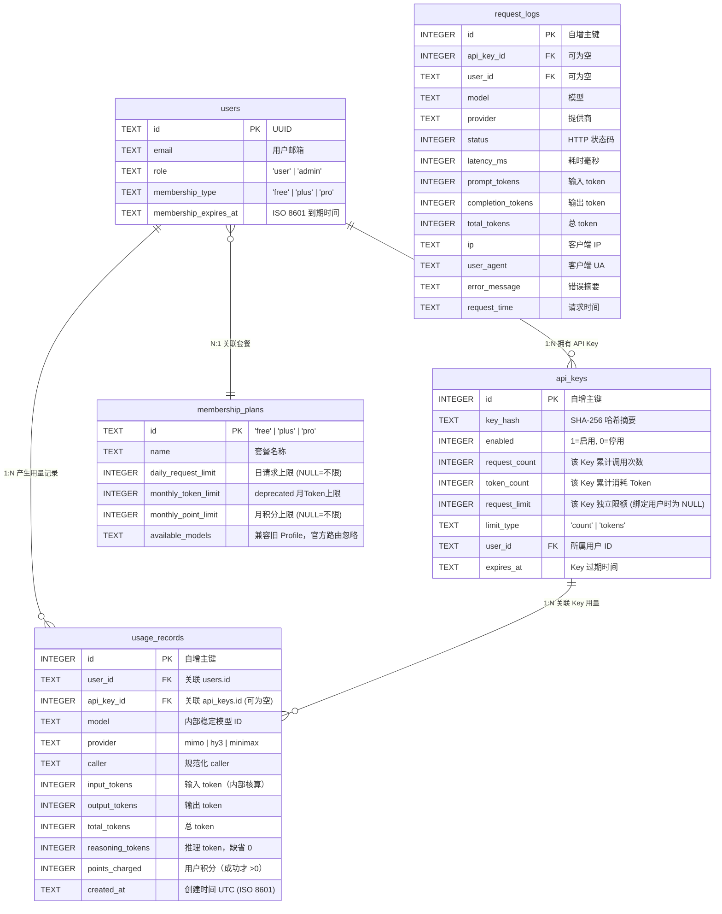
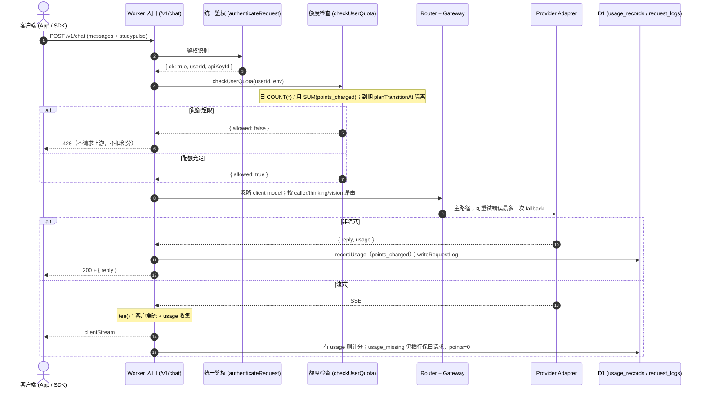

# StudyPulse Cloud AI — 套餐与用量限制实现技术文档

**Version:** `0.9-beta`  
**Runtime:** Cloudflare Workers + Cloudflare D1 (`StudyPulseDB`)  
**AI Gateway:** Router + Points ledger  
**Last Updated:** 2026-08-28  

---

## 1. 概述

StudyPulse Cloud AI 实现了基于用户 ID (`user_id`) 的**统一会员与用量限制体系**。无论是通过移动端/Web 端的 Session Token 登录，还是通过开发者 API Key 调用，最终均汇聚到统一的用量账本表 `usage_records` 中进行配额校验与扣减统计。

本系统采用**账本模式（Ledger Pattern）**与**动态时间窗口（Dynamic Windowing）**设计，无需定时任务即可实现秒级精确的 UTC+8 自然日与自然月配额重置。

---

## 2. 套餐规格与规则表 (Membership Plans)

所有套餐规格配置持久化保存在 D1 的 `membership_plans` 表中，支持管理后台在线动态调整，避免代码硬编码。

| 套餐 ID (`id`) | 显示名称 (`name`) | 日请求上限 (`daily_request_limit`) | 月积分上限 (`monthly_point_limit`) | 可用模型白名单 (`available_models`) | 说明 |
| :--- | :--- | :--- | :--- | :--- | :--- |
| **`free`** | **Free** | **5 次 / 日** | **5,000 Points / 月** | 保留字段，官方请求不按此选模型 | 新注册用户默认分配 |
| **`plus`** | **Plus** | **50 次 / 日** | **200,000 Points / 月** | 同上 | 基础付费 / 贡献兑换 |
| **`pro`** | **Pro** | **200 次 / 日** | **400,000 Points / 月** | 同上 | 高级付费 |
| **`admin` (角色)** | **管理员** | **无限制 (跳过检查)** | **无限制 (跳过检查)** | 全部 | `users.role = 'admin'` |

> [!NOTE]
> - 以上积分为 INTERNAL_TEST（约按原 Token 限额 10 token/point 换算），不是商业报价。
> - `monthly_token_limit` 列保留但 **deprecated**，配额校验改为 `SUM(points_charged)`。
> - 历史用量行 `points_charged` 默认 0，不做 Token 折算。
> - `role = 'admin'` 在 `checkUserQuota()` 中直接 `{ allowed: true }`。
> - 官方 `/v1/chat` **绕过** `available_models`；该字段仅兼容旧 Profile API。

---

## 3. 数据库 Schema 与实体关系

核心数据库表结构及其在额度扣减中的职责如下：



### 关键表设计细节

1. **`usage_records` (只追加流水账本)**
   - 记录每次成功的 AI 调用。
   - `input_tokens` / `output_tokens` / `total_tokens` 字段均设定 `DEFAULT 0`，确保即使上游流未返回 usage，统计函数 `SUM()` 也绝不会得到 `NULL`。
   - 建立复合索引：`CREATE INDEX idx_usage_records_user_created ON usage_records(user_id, created_at);`，保证按用户和时间区间的聚合查询达到毫秒级响应。

2. **`api_keys` (支持独立 Key 与绑定用户 Key 双轨制)**
   - **绑定用户的 Key**：`user_id` 有值，`request_limit` 设为 `NULL`。额度由 `users` 表关联的会员等级统一管控，避免双重限制冲突。
   - **历史旧匿名 Key**：`user_id` 为空，依赖 `request_limit` 和 `limit_type` 维持独立的单 Key 总量控制。

---

## 4. “请求次数 + Points” 扣减全流程机制

AI 调用接口 `/v1/chat` 的执行与记量流程遵循 **“先预检、后调用、最终成功才计用户积分”**：



### 4.1 计次与扣费核心规则

1. **请求次数 (Daily Request Count)**
   - `COUNT(*) FROM usage_records WHERE user_id = ? AND datetime(created_at) >= datetime(?)`
   - 一次用户请求一条 usage 行（fallback 不算第二次请求）。流式 `usage_missing` 仍插行，以保住日请求计数。
2. **月积分 (Monthly Points)**
   ```sql
   SELECT COALESCE(SUM(points_charged), 0) AS total
     FROM usage_records
    WHERE user_id = ?
      AND datetime(created_at) >= datetime(?)
   ```
   - 若 `total >= monthly_point_limit`，返回 `Monthly point limit exceeded`。
   - `points = ceil(millipoints / 1000)`，系数在 `PRICING["2026-08-v1"]`。
3. **失败不计用户积分**：鉴权失败、400/413、429、abort、最终失败的 502 不写 `usage_records`（或 `points_charged=0` 仅当 usage_missing 成功占位）。primary 失败的上游成本只进 `request_logs`。

---

## 5. Token 统计与流式提取细节

Token 仍写入账本供内部成本核算；用户 Dashboard 只展示 Points。

### 5.1 非流式 (Non-stream)

Adapter 从上游 Chat Completions JSON 的 `usage` 提取 prompt/completion；无 reasoning 字段则 `reasoning_tokens=0`。

### 5.2 流式 (SSE stream)

`ReadableStream.tee()`：客户端一份，网关扫描 SSE 提取最后一次 `usage`。缺 usage 时 `points_charged=0`，`request_logs.error_message=usage_missing`。

---

## 6. 月度与日度重置机制

### 6.1 零 Cron 动态时间窗口设计

系统**没有**使用定时任务（Cron Trigger）去周期性清零数据库字段。重置是通过**查询时间起点的动态推进**实现的：

每次鉴权检查或控制台查询时，基于 **UTC+8 (Asia/Shanghai)** 时区计算当前时间窗口的起点时间戳：

```javascript
// 获取当前 UTC+8 的年月日
const nowParts = new Intl.DateTimeFormat("en-US", {
    timeZone: "Asia/Shanghai",
    year: "numeric",
    month: "numeric",
    day: "numeric",
}).formatToParts(new Date());

const dateParts = Object.fromEntries(
    nowParts.filter((part) => part.type !== "literal").map((part) => [part.type, Number(part.value)]),
);

// 1. 今日起点：当前自然日 00:00:00 (UTC+8) 对应的 UTC 时间戳
const todayStartDate = new Date(Date.UTC(dateParts.year, dateParts.month - 1, dateParts.day) - 8 * 60 * 60 * 1000);
const todayStart = todayStartDate.toISOString();

// 2. 本月起点：当月 1 日 00:00:00 (UTC+8) 对应的 UTC 时间戳
const monthStartDate = new Date(Date.UTC(dateParts.year, dateParts.month - 1, 1) - 8 * 60 * 60 * 1000);
const monthStart = monthStartDate.toISOString();
```

- **日请求重置**：每天北京时间 `00:00:00` 一过，`todayStart` 自动跳到新的一天，昨天的 `usage_records` 不再命中 `created_at >= todayStart`，日请求次数瞬时归零。
- **月积分重置**：每月 1 号北京时间 `00:00:00` 一过，`monthStart` 自动跳到本月 1 号。

### 6.2 会员到期动态降级与历史用量隔离 (Plan Transition Isolation)

当 Plus 或 Pro 会员到期时，系统设计了优雅降级与额度隔离保护逻辑：

1. **运行时无锁降级**：
   当 `user.membership_type !== 'free'` 且 `new Date() >= new Date(user.membership_expires_at)` 时，系统在内存中直接判定其 `effectivePlan = 'free'`，无需写库操作。
2. **用量隔离保护算法**：
   > [!IMPORTANT]
   > 若用户在 Pro 期间当月已消耗 1,500,000 Tokens，在月中到期降级为 Free（月额度 50,000 Tokens）时，如果简单按当月 1 日起算，用户会因为 `1,500,000 >= 50,000` 而立刻被限额封锁。
   
   因此系统设置了转换时间戳 `planTransitionAt = expiresAt`：
   ```javascript
   // 若降级发生在当前计费周期内，Free 配额只统计到期时刻之后产生的用量
   const dailyQuotaStart = planTransitionAt && planTransitionAt > todayStartDate
       ? planTransitionAt.toISOString()
       : todayStart;

   const monthlyQuotaStart = planTransitionAt && planTransitionAt > monthStartDate
       ? planTransitionAt.toISOString()
       : monthStartDate.toISOString();
   ```
   **效果**：用户在付费期内消耗的积分不会侵占降级后的 Free 配额，降级后立即享受全新的 5 次/日请求与 5,000 Points/月免费额度。

---

## 7. 核心中间件与服务代码一览

| 模块文件 | 核心函数 / 职责 | 实现逻辑说明 |
| :--- | :--- | :--- |
| [`src/auth/middleware.js`](file:///Users/chenkaigao/Documents/Program/Web/studypulse-cloud-ai/src/auth/middleware.js) | `authenticateRequest(request, env)` | 双鉴权统一入口，解析 `sp_sess_` (Session) 或 `sp_beta_` (API Key)，输出统一的 `userId` 与 `apiKeyId`。 |
| [`src/membership/membership.js`](../src/membership/membership.js) | `getMembershipPlan(planId, env)` | 查询套餐日请求与 `monthly_point_limit`。 |
| [`src/membership/membership.js`](../src/membership/membership.js) | `checkUserQuota(userId, env)` | admin 跳过、到期降级、`COUNT(*)` 日请求、`SUM(points_charged)` 月积分。 |
| [`src/membership/membership.js`](../src/membership/membership.js) | `recordUsage(...)` | 调用 `recordUsageRecord` 写入账本（含 points / routing_version）。 |
| [`src/database/usage.js`](../src/database/usage.js) | `recordUsageRecord` | 实际 INSERT `usage_records`。 |
| [`src/ai/gateway.js`](../src/ai/gateway.js) | `executeChat` | Router → Adapter → 一次 fallback → tee → 账本。 |
| [`src/index.js`](../src/index.js) | `handleChat(...)` | 鉴权、body 规范化、额度、调 gateway。不在入口堆 provider if/else。 |
| [`src/dashboard/routes.js`](../src/dashboard/routes.js) | `handleUserDashboardApi(...)` | 用户控制台：请求数 + Points，不返回 token。 |

---

## 8. 错误响应码对照

当用量或权限受到限制时，接口返回标准 RFC 7807 风格 JSON 错误：

| HTTP 状态码 | 错误消息 (`error`) | 触发场景 | 客户端处理建议 |
| :--- | :--- | :--- | :--- |
| **`429`** | `Daily request limit exceeded` | 当日请求次数已达到当前套餐的日上限 | 提示用户次日 00:00 (UTC+8) 刷新，或引导升级套餐 |
| **`429`** | `Monthly point limit exceeded` | 当月积分达到套餐上限 | 提示次月 1 日 00:00 (UTC+8) 刷新或升级 |
| **`403`** | `Account banned` | 账号被封禁 | 前往申诉支持中心 |
| **`413`** | `Request body too large` | 请求体大小超过 256 KiB | 减小请求体体积或缩减图片/内容项 |
| **`400`** | `Message too long` / `Too many content items` | 消息字符数超过 32,768 或 content 项超过 16 | 缩短单次提问文本长度 |
